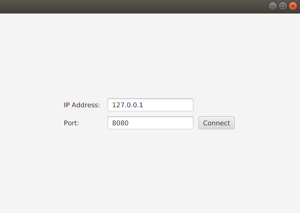
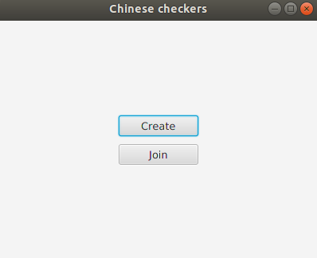
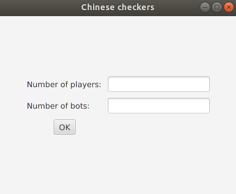
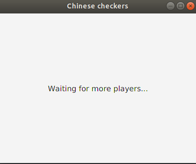
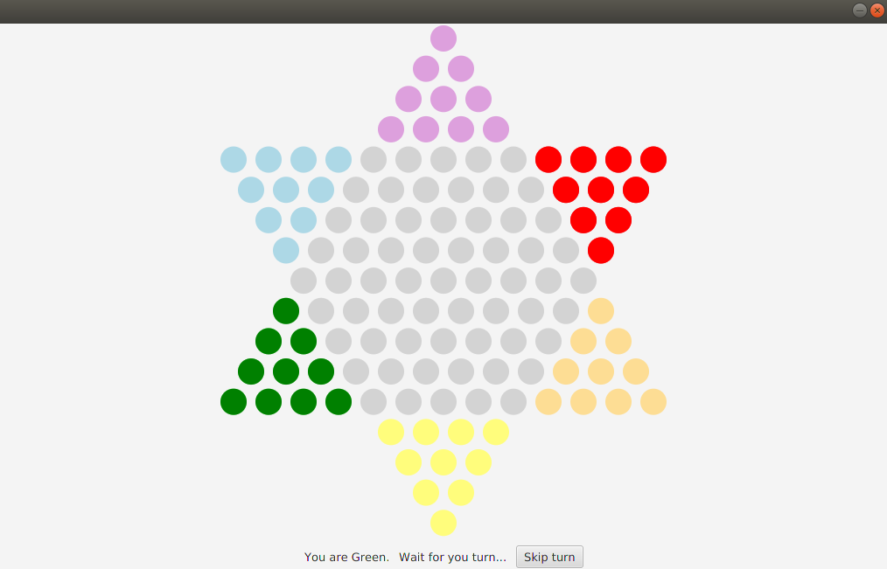
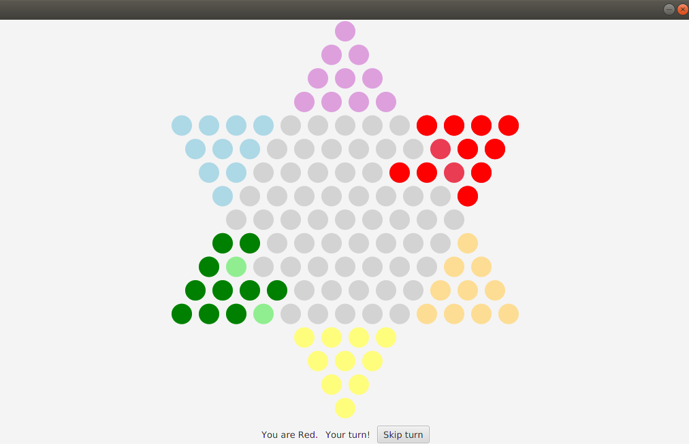

# chinese-checkers
An implementation of the popular chinese checkers featuring both multiplayer gameplay (through TCP sockets), as well as offline-game, against bots.

## Rules
The rules are completely in accordance with the 

## Technological stack

* The server is based upon TCP sockets. The communication is implemented using a simple string-based communication protocol.
* The client was created using JavaFX. 
* During the development of the project, Java SE 8 was used.

## Features

* The server is multithreaded, allowing for many games taking place in parallel.
* You can start the server on your machine, provide the IP and the port to the one you want to play with, and they can simply connect. However, remember that your ports need to be forwarded appropriately.
* You can add any number of bots as long as this does not violate the rules of the game.

To implement the features, string-based communication protocol was used.

